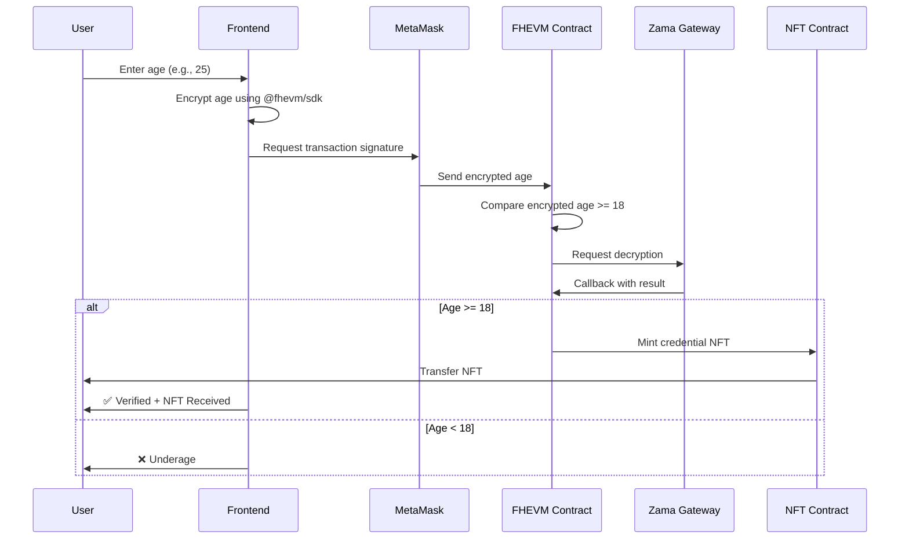

# 🔐 FHEVM Age Verifier with NFT Credentials


<div align="center">

[](LICENSE)
[](https://soliditylang.org/)
[](https://react.dev/)
[](https://www.zama.ai/)

**A privacy-preserving age verification system with NFT credentials, powered by Fully Homomorphic Encryption**

[Live Demo](https://harmonious-cuchufli-91fdd3.netlify.app/) | [Documentation](DEPLOYMENT.md) | [Quick Start](#-quick-start)

</div>

---

## 📖 Table of Contents

- [Overview](#-overview)
- [Features](#-features)
- [Architecture](#-architecture)
- [Quick Start](#-quick-start)
- [Deployment Guide](#-deployment-guide)
- [How It Works](#-how-it-works)
- [Project Structure](#-project-structure)
- [Technologies](#-key-technologies)
- [Security](#-security-considerations)
- [Contributing](#-contributing)
- [License](#-license)

---

## 🌟 Overview

This project demonstrates a **privacy-preserving age verification system** built on **Zama's FHEVM (Fully Homomorphic Encryption Virtual Machine)**. Users can prove they are 18 or older without revealing their actual age, and receive a **soulbound NFT credential** as verifiable proof.

### Why This Matters

- **🔒 Privacy First**: Your actual age never leaves your device in plain text
- **🎫 Verifiable Credentials**: On-chain proof without exposing sensitive data
- **🌐 Decentralized**: No central authority storing your personal information
- **🚫 Non-Transferable**: Soulbound NFTs prevent credential trading

---

## ✨ Features

### Core Functionality

| Feature | Description |
|---------|-------------|
| 🔐 **FHE Encryption** | Age data encrypted using Fully Homomorphic Encryption |
| 🎫 **NFT Credentials** | Soulbound (non-transferable) ERC-721 tokens |
| 🖼️ **On-Chain SVG** | NFT artwork generated entirely on-chain |
| 🌐 **Sepolia Testnet** | Deployed and tested on Ethereum Sepolia |
| 💼 **Modern UI** | Responsive React interface with TailwindCSS |
| 🔄 **Real-time Status** | Live FHE Gateway health monitoring |
| 📱 **MetaMask Integration** | Seamless wallet connection |

---

## 🏗️ Architecture

### Smart Contracts

```
┌─────────────────────────────────────────────────────────┐
│                   User Interface                        │
│              (React + @fhevm/sdk)                      │
└────────────────────┬────────────────────────────────────┘
                     │ Encrypted Age
                     ↓
┌─────────────────────────────────────────────────────────┐
│            AgeVerifierWithNFT.sol                       │
│  • Receives encrypted age (euint32)                    │
│  • Compares: encryptedAge >= 18 (on encrypted data)    │
│  • Requests decryption via Gateway                     │
│  • Triggers NFT mint on success                        │
└────────────────────┬────────────────────────────────────┘
                     │ Mint NFT
                     ↓
┌─────────────────────────────────────────────────────────┐
│          AgeCredentialNFT_Simple.sol                    │
│  • ERC-721 compliant                                    │
│  • Stores encrypted age                                │
│  • Soulbound (non-transferable)                        │
│  • On-chain SVG generation                             │
└─────────────────────────────────────────────────────────┘
```

### Technology Stack

**Smart Contracts:**
- Solidity 0.8.24
- Zama FHEVM SDK
- OpenZeppelin Contracts
- Hardhat Development Environment

**Frontend:**
- React 19 + TypeScript
- Vite Build Tool
- TailwindCSS Styling
- Ethers.js v6
- @fhevm/sdk for FHE operations

---

## 🚀 Quick Start

### Prerequisites

Before you begin, ensure you have:

- ✅ **Node.js** v20 or higher ([Download](https://nodejs.org/))
- ✅ **MetaMask** browser extension ([Install](https://metamask.io/))
- ✅ **Sepolia ETH** for gas fees ([Faucet](https://sepoliafaucet.com/))
- ✅ **Git** installed ([Download](https://git-scm.com/))

### Installation

#### 1️⃣ Clone the Repository

```bash
# Clone via HTTPS
git clone https://github.com/xnbi/Age-Verifier-based-on-ZAMA-s-Fhevm-technology.git

# Or clone via SSH
git clone git@github.com:xnbi/Age-Verifier-based-on-ZAMA-s-Fhevm-technology.git

# Navigate to project directory
cd Age-Verifier-based-on-ZAMA-s-Fhevm-technology
```

#### 2️⃣ Install Dependencies

```bash
# Install contract dependencies
cd contracts
npm install

# Install frontend dependencies
cd ../frontend
npm install
```

#### 3️⃣ Deploy Smart Contracts

```bash
cd contracts

# Set your mnemonic securely
npx hardhat vars set MNEMONIC "your twelve word mnemonic phrase here"

# Deploy contracts to Sepolia
npx hardhat run scripts/deploy-with-nft.ts --network sepolia
```

**Expected Output:**
```
🚀 Deploying FHEVM Age Verifier with NFT...
📝 Deploying NFT Contract...
✅ AgeCredentialNFT deployed to: 0x1234...
📝 Deploying Age Verifier...
✅ AgeVerifierWithNFT deployed to: 0x5678...
🎉 Deployment Complete!
```

**📋 Save these addresses!** You'll need them for frontend configuration.

#### 4️⃣ Configure Frontend

Create `frontend/.env` file:

```env
VITE_CONTRACT_ADDRESS=0x5678...  # Your AgeVerifierWithNFT address
VITE_NFT_CONTRACT_ADDRESS=0x1234...  # Your AgeCredentialNFT address
```

#### 5️⃣ Run Development Server

```bash
cd frontend
npm run dev
```

Visit **http://localhost:5173** and start verifying! 🎉

---

## 🌐 Deployment Guide

### 📦 Deploy to GitHub

#### Step 1: Initialize Git Repository

```bash
# Navigate to project root
cd Age-Verifier-based-on-ZAMA-s-Fhevm-technology

# Initialize git (if not already done)
git init

# Add all files
git add .

# Commit changes
git commit -m "Initial commit: FHEVM Age Verifier with NFT credentials"
```

#### Step 2: Create GitHub Repository

1. Go to [GitHub](https://github.com/new)
2. Repository name: `Age-Verifier-based-on-ZAMA-s-Fhevm-technology`
3. Make it **Public** (recommended for portfolio)
4. **Do NOT** initialize with README (we already have one)
5. Click **"Create repository"**

#### Step 3: Push to GitHub

```bash
# Add remote repository
git remote add origin https://github.com/YOUR_USERNAME/Age-Verifier-based-on-ZAMA-s-Fhevm-technology.git

# Rename branch to main
git branch -M main

# Push to GitHub
git push -u origin main
```

**Using Personal Access Token:**

If prompted for credentials:
- Username: Your GitHub username
- Password: Your Personal Access Token ([Create one](https://github.com/settings/tokens))

Or push directly with token:

```bash
git push https://YOUR_TOKEN@github.com/YOUR_USERNAME/Age-Verifier-based-on-ZAMA-s-Fhevm-technology.git main
```

---

### 🚀 Deploy to Netlify

#### Method 1: Drag & Drop (Fastest)

1. **Build the project:**
   ```bash
   cd frontend
   npm run build
   ```

2. **Upload to Netlify:**
   - Go to [Netlify Drop](https://app.netlify.com/drop)
   - Drag the `frontend/dist` folder to the page
   - Wait for deployment to complete

3. **Add Environment Variables:**
   - Go to **Site settings** → **Environment variables**
   - Add:
     ```
     VITE_CONTRACT_ADDRESS=0xYourVerifierAddress
     VITE_NFT_CONTRACT_ADDRESS=0xYourNFTAddress
     ```

4. **Redeploy:**
   - **Deploys** → **Trigger deploy** → **Clear cache and deploy site**

#### Method 2: Connect GitHub Repository

1. **Connect to Netlify:**
   - Go to [Netlify](https://app.netlify.com/)
   - Click **"Add new site"** → **"Import an existing project"**
   - Choose **GitHub** and authorize Netlify
   - Select your `Age-Verifier-based-on-ZAMA-s-Fhevm-technology` repository

2. **Build Settings:**
   
   Netlify will auto-detect `netlify.toml`, but verify:
   ```
   Base directory: frontend
   Build command: npm run build
   Publish directory: frontend/dist
   ```

3. **Environment Variables:**
   - Add environment variables as shown in Method 1

4. **Deploy:**
   - Click **"Deploy site"**
   - Wait for build to complete

#### Method 3: Netlify CLI

```bash
# Install Netlify CLI
npm install -g netlify-cli

# Login to Netlify
netlify login

# Build the project
cd frontend
npm run build

# Deploy
netlify deploy --prod --dir=dist
```

---

## 🔍 How It Works

### Age Verification Flow



### FHE Encryption Process

1. **Client-Side Encryption**
   - User enters age in browser
   - `@fhevm/sdk` encrypts age using FHE public key
   - Only encrypted data (`euint32`) leaves the client

2. **On-Chain Computation**
   - Smart contract receives `euint32` (encrypted age)
   - Performs comparison: `encryptedAge >= encryptedThreshold`
   - Result is also encrypted (`ebool`)

3. **Decryption via Gateway**
   - Contract requests decryption from Zama Gateway
   - Gateway decrypts result in secure enclave
   - Callback sent to contract with plaintext result

4. **NFT Minting**
   - If verified, NFT is automatically minted
   - Encrypted age stored in NFT for future use
   - User receives soulbound credential

### NFT Features

- **ERC-721 Compliant**: Standard NFT implementation
- **Soulbound**: Transfer function disabled (non-transferable)
- **On-Chain SVG**: Artwork generated entirely on-chain
- **Metadata**: Stores encrypted age and verification timestamp
- **Unique**: One NFT per verified address

---

## 📁 Project Structure

```
Age-Verifier-based-on-ZAMA-s-Fhevm-technology/
│
├── contracts/                      # Smart contract code
│   ├── contracts/
│   │   ├── AgeVerifierWithNFT.sol           # Main verification contract
│   │   └── AgeCredentialNFT_Simple.sol      # NFT credential contract
│   ├── scripts/
│   │   └── deploy-with-nft.ts               # Deployment script
│   ├── tasks/                               # Hardhat tasks
│   ├── test/                                # Contract tests
│   ├── hardhat.config.ts                    # Hardhat configuration
│   └── package.json
│
├── frontend/                       # React application
│   ├── src/
│   │   ├── App.tsx                          # Main app component
│   │   ├── main.tsx                         # Entry point
│   │   ├── contexts/
│   │   │   └── FHEVMContext.tsx             # FHE SDK context
│   │   ├── providers/
│   │   │   └── PrivyProvider.tsx            # (Optional) Auth provider
│   │   ├── AgeVerifier.json                 # Contract ABI
│   │   └── index.css                        # Global styles
│   ├── public/
│   │   └── _redirects                       # Netlify SPA routing
│   ├── dist/                                # Build output (generated)
│   ├── vite.config.ts                       # Vite configuration
│   ├── tailwind.config.js                   # Tailwind CSS config
│   └── package.json
│
├── .gitignore                      # Git ignore rules
├── netlify.toml                    # Netlify configuration
├── README.md                       # This file
├── DEPLOYMENT.md                   # Detailed deployment guide
├── QUICK-START.md                  # Quick reference
└── LICENSE                         # MIT License
```

---

## 🔑 Key Technologies

### Blockchain & Cryptography

| Technology | Purpose | Documentation |
|------------|---------|---------------|
| **Zama FHEVM** | Fully Homomorphic Encryption | [Docs](https://docs.zama.ai/fhevm) |
| **Solidity 0.8.24** | Smart contract language | [Docs](https://docs.soliditylang.org/) |
| **Hardhat** | Development environment | [Docs](https://hardhat.org/docs) |
| **OpenZeppelin** | Secure contract libraries | [Docs](https://docs.openzeppelin.com/) |
| **Sepolia Testnet** | Ethereum test network | [Faucet](https://sepoliafaucet.com/) |

### Frontend Stack

| Technology | Purpose | Documentation |
|------------|---------|---------------|
| **React 19** | UI framework | [Docs](https://react.dev/) |
| **TypeScript** | Type-safe JavaScript | [Docs](https://www.typescriptlang.org/) |
| **Vite** | Fast build tool | [Docs](https://vite.dev/) |
| **TailwindCSS** | Utility-first CSS | [Docs](https://tailwindcss.com/) |
| **Ethers.js v6** | Ethereum library | [Docs](https://docs.ethers.org/v6/) |
| **@fhevm/sdk** | FHE operations | [Docs](https://docs.zama.ai/fhevm) |

---

## 🧪 Testing

### Frontend Testing

```bash
cd frontend

# Type checking
npm run build

# Production build
npm run build

# Preview production build
npm run preview
```

### Contract Testing

```bash
cd contracts

# Run all tests
npx hardhat test

# Run with coverage
npx hardhat coverage

# Run specific test file
npx hardhat test test/AgeVerifier.test.ts
```

### Local Network Testing

```bash
# Terminal 1: Start local Hardhat node
npx hardhat node

# Terminal 2: Deploy to local network
npx hardhat run scripts/deploy-with-nft.ts --network localhost
```

---

## 🛡️ Security Considerations

### ✅ Implemented Security Measures

1. **FHE Encryption**
   - All age data encrypted client-side
   - Only encrypted values on-chain
   - Comparison operations on encrypted data

2. **Soulbound NFTs**
   - Non-transferable credentials
   - Prevents secondary market trading
   - One credential per address

3. **Gateway Security**
   - Official Zama Gateway for decryption
   - Secure enclave for sensitive operations
   - Callback authentication

4. **Access Control**
   - Only verifier contract can mint NFTs
   - Role-based permissions using OpenZeppelin
   - Owner-only administrative functions

5. **Smart Contract Best Practices**
   - ReentrancyGuard on critical functions
   - Input validation
   - Events for transparency
   - Auditable code

### ⚠️ Known Limitations

- **Testnet Only**: Currently deployed on Sepolia testnet
- **Mock Mode**: Falls back to unencrypted when Gateway offline
- **Gas Costs**: FHE operations more expensive than regular comparisons
- **Gateway Dependency**: Requires Zama Gateway availability

---

## 📊 Contract Addresses

### Sepolia Testnet

| Contract | Address | Explorer |
|----------|---------|----------|
| **AgeVerifierWithNFT** | `0x...` | [View on Etherscan](#) |
| **AgeCredentialNFT** | `0x...` | [View on Etherscan](#) |

*Replace with your deployed addresses after deployment*

---

## 🤝 Contributing

Contributions are welcome! Here's how you can help:

### Ways to Contribute

- 🐛 Report bugs and issues
- 💡 Suggest new features
- 📝 Improve documentation
- 🔧 Submit pull requests
- ⭐ Star this repository

### Development Workflow

1. **Fork** the repository
2. **Clone** your fork
   ```bash
   git clone https://github.com/xnbi/Age-Verifier-based-on-ZAMA-s-Fhevm-technology.git
   ```
3. **Create** a feature branch
   ```bash
   git checkout -b feature/amazing-feature
   ```
4. **Commit** your changes
   ```bash
   git commit -m "Add amazing feature"
   ```
5. **Push** to your fork
   ```bash
   git push origin feature/amazing-feature
   ```
6. **Open** a Pull Request

### Code Standards

- Follow existing code style
- Add tests for new features
- Update documentation as needed
- Keep commits atomic and well-described

---

## 📄 License

This project is licensed under the **MIT License**.

```
MIT License

Copyright (c) 2025 [Your Name]

Permission is hereby granted, free of charge, to any person obtaining a copy
of this software and associated documentation files (the "Software"), to deal
in the Software without restriction, including without limitation the rights
to use, copy, modify, merge, publish, distribute, sublicense, and/or sell
copies of the Software, and to permit persons to whom the Software is
furnished to do so, subject to the following conditions:

The above copyright notice and this permission notice shall be included in all
copies or substantial portions of the Software.

THE SOFTWARE IS PROVIDED "AS IS", WITHOUT WARRANTY OF ANY KIND, EXPRESS OR
IMPLIED, INCLUDING BUT NOT LIMITED TO THE WARRANTIES OF MERCHANTABILITY,
FITNESS FOR A PARTICULAR PURPOSE AND NONINFRINGEMENT. IN NO EVENT SHALL THE
AUTHORS OR COPYRIGHT HOLDERS BE LIABLE FOR ANY CLAIM, DAMAGES OR OTHER
LIABILITY, WHETHER IN AN ACTION OF CONTRACT, TORT OR OTHERWISE, ARISING FROM,
OUT OF OR IN CONNECTION WITH THE SOFTWARE OR THE USE OR OTHER DEALINGS IN THE
SOFTWARE.
```

See [LICENSE](LICENSE) file for details.

---

## 🙏 Acknowledgments

Special thanks to:

- **[Zama](https://www.zama.ai/)** - For pioneering FHE technology and FHEVM
- **[Hardhat](https://hardhat.org/)** - For excellent development tools
- **[OpenZeppelin](https://openzeppelin.com/)** - For secure smart contract libraries
- **[Ethereum Foundation](https://ethereum.org/)** - For the Sepolia testnet
- **[Netlify](https://netlify.com/)** - For seamless deployment

---

## 📞 Contact & Links

### Author

- **GitHub**: [@xnbi](https://github.com/xnbi)
- **Project**: [Age-Verifier-based-on-ZAMA-s-Fhevm-technology](https://github.com/xnbi/Age-Verifier-based-on-ZAMA-s-Fhevm-technology)

### Resources

- 🌐 **Live Demo**: [Deploy your own!](#-deployment-guide)
- 📚 **Zama Docs**: [docs.zama.ai](https://docs.zama.ai/)
- 💬 **Zama Discord**: [discord.fhe.org](https://discord.fhe.org)
- 🐙 **FHEVM GitHub**: [github.com/zama-ai/fhevm](https://github.com/zama-ai/fhevm)
- 🔧 **Hardhat Docs**: [hardhat.org](https://hardhat.org/)

---

## 🚀 What's Next?

### Potential Improvements

- [ ] Deploy to mainnet (once FHEVM is production-ready)
- [ ] Add more verification types (income, credit score, etc.)
- [ ] Implement credential revocation
- [ ] Multi-chain support
- [ ] Mobile app integration
- [ ] Batch verification for efficiency
- [ ] Integration with DeFi protocols

### Use Cases

This technology can be extended to:

- 🏦 **DeFi**: Prove creditworthiness without revealing financial data
- 🎮 **Gaming**: Age-gated content without doxxing
- 🗳️ **Voting**: Prove eligibility without identity exposure
- 🏥 **Healthcare**: Verify prescriptions privately
- 🎓 **Education**: Prove qualifications without transcripts

---

<div align="center">

**Built with ❤️ using Zama FHEVM**

⭐ **Star this repo if you find it useful!** ⭐

[Report Bug](https://github.com/xnbi/Age-Verifier-based-on-ZAMA-s-Fhevm-technology/issues) · 
[Request Feature](https://github.com/xnbi/Age-Verifier-based-on-ZAMA-s-Fhevm-technology/issues) · 
[Documentation](DEPLOYMENT.md)

</div>
